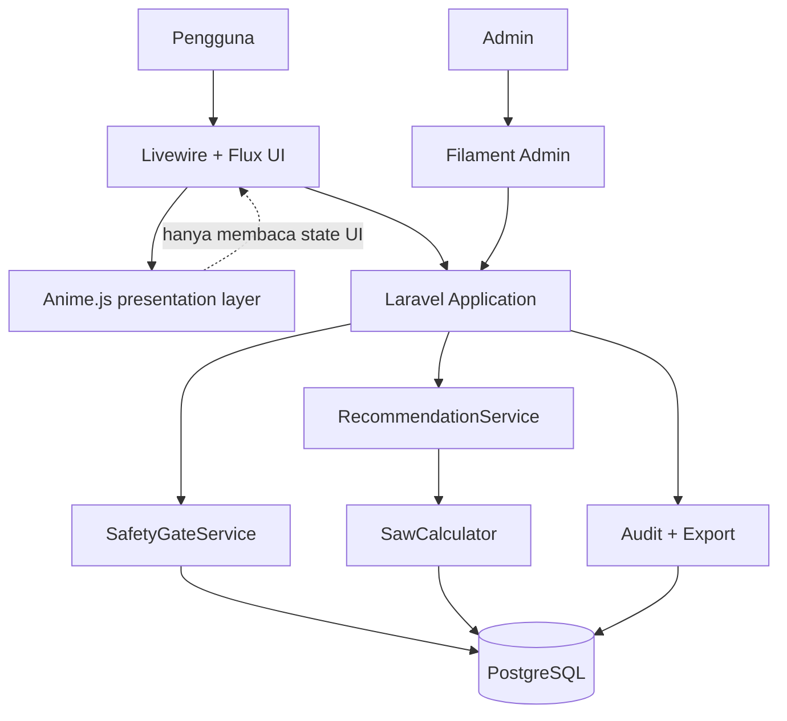
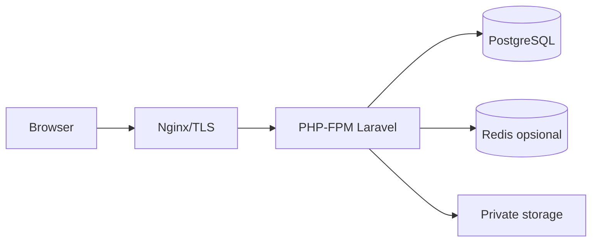
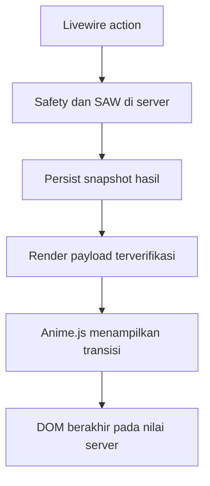

# Arsitektur Sistem Laravel - PostgreSQL

## 1. Stack

- Laravel 13 sebagai framework aplikasi.
- PHP sesuai persyaratan resmi Laravel 13 saat implementasi.
- PostgreSQL sebagai database transaksional.
- Livewire 4 + Blade untuk UI reaktif.
- Tailwind CSS + Flux UI untuk design system pengguna.
- Anime.js 4 untuk animasi fungsional, transisi layout, SVG, dan umpan balik interaksi.
- Filament 5 untuk panel admin.
- Redis opsional untuk cache, queue, dan rate limiting.
- Nginx + PHP-FPM untuk produksi.

Versi harus dikunci di `composer.lock`/`package-lock.json`; dokumentasi tidak boleh dianggap sebagai izin untuk selalu mengambil versi terbaru tanpa regression test.

## 2. Arsitektur logis



## 3. Lapisan aplikasi

| Lapisan | Tanggung jawab |
|---|---|
| Presentation | Livewire pages, Blade components, Filament resources |
| Application | Use case konsultasi, aktivasi dataset, ekspor, versioning |
| Domain | Safety rules, eligibility, score mapping, SAW, explanation |
| Infrastructure | Eloquent repositories, PostgreSQL, cache, file storage, queue |
| Motion presentation | Modul Anime.js, scope komponen, reduced motion, dan cleanup lifecycle |

## 4. Service inti

- `SafetyGateService`: mengevaluasi red flag dan hard constraint.
- `EligibilityService`: menentukan varian yang boleh masuk ranking.
- `CriterionScoringService`: membentuk nilai 1-5 berdasarkan knowledge base.
- `SawCalculator`: normalisasi dan agregasi berbobot secara deterministik.
- `RecommendationService`: mengorkestrasi filter, scoring, ranking, dan tie-break.
- `ExplanationService`: menghasilkan alasan per kriteria dari fakta, bukan teks generatif bebas.
- `DatasetVersionService`: membekukan snapshot formula, aturan, dan bobot.
- `ProductEvidenceService`: memvalidasi sumber, tanggal, dan status komposisi.

## 5. Boundary transaksi

Pembuatan konsultasi, snapshot input, hasil safety gate, matriks, dan ranking harus berada dalam satu transaksi. Aktivasi versi bobot/dataset juga transaksional dan memastikan hanya satu versi aktif.

## 6. Keamanan

- Autentikasi admin, verifikasi email opsional untuk pengguna.
- Laravel policies/gates; admin tidak ditentukan hanya melalui field request.
- CSRF untuk route web, rate limit konsultasi dan login.
- Sanitasi teks sumber; URL hanya `https`.
- Jangan menyimpan STR dokter di halaman publik. Jika dibutuhkan untuk bukti akademik, simpan terenkripsi dan batasi akses.
- Audit log bersifat append-only untuk perubahan bobot, rule, produk, formula, dan status publish.

## 7. Strategi cache

Cache hanya untuk katalog publik dan knowledge base aktif. Hasil konsultasi tidak boleh memakai cache global tanpa key yang memuat hash input dan version ID. Cache dibersihkan saat versi dataset diaktifkan.

## 8. Deployment minimum



- HTTPS wajib.
- Database tidak diekspos ke internet.
- Backup terenkripsi dan uji pemulihan berkala.
- `.env` tidak masuk repository.
- Jalankan `php artisan migrate --force` hanya dalam proses deployment terkontrol.

## 9. Pilihan template

**Pilihan utama:** Laravel Livewire Starter Kit resmi, header layout, Flux UI, Tailwind. **Admin:** Filament. Hindari menggabungkan banyak template dashboard berbeda karena menambah CSS/JS dan membuat konsistensi aksesibilitas sulit dijaga.

## 10. Batas arsitektur Anime.js

- Laravel tetap menjadi sumber kebenaran untuk safety gate, eligibility, C1-C6, normalisasi, dan ranking.
- Livewire mengirim state hasil; Anime.js hanya mengubah properti visual seperti opacity, transform, width, dan nilai tampilan.
- Modul animasi ditempatkan di `resources/js/animations/` dan diimpor melalui Vite agar fungsi yang tidak dipakai dapat dieliminasi saat build.
- Gunakan `createScope()` dengan root komponen untuk menghindari selector mengenai elemen di luar komponen dan untuk melakukan `revert()` saat komponen dilepas.
- Semua interaksi tetap berfungsi jika JavaScript atau animasi gagal; tombol dan form tidak bergantung pada selesainya timeline.
- Status red flag dan error validasi muncul segera serta diumumkan melalui elemen live region yang sesuai.

## 11. Alur data hasil dan animasi



## 12. Lifecycle guest dan akun

```mermaid
sequenceDiagram
    participant G as Guest browser
    participant L as Livewire wizard
    participant A as Laravel app
    participant DB as PostgreSQL
    participant U as Account

    G->>L: Isi wizard tanpa login
    L->>A: finish(profile)
    A->>DB: Simpan consultation + run + snapshot
    A-->>G: Hasil UUID; simpan UUID pada session guest
    G->>A: Pilih Masuk/daftar dan simpan
    A-->>U: Login/register dengan intended URL
    U->>A: Kembali ke route claim
    A->>DB: Isi user_id, hapus expires_at
    A-->>G: Hasil yang sama, tanpa run baru
```

`consultations.user_id` nullable memungkinkan guest-first. Session guest menjadi batas akses sementara; setelah claim, policy kepemilikan akun menjadi batas akses utama. CTA login ditempatkan setelah hasil karena autentikasi bukan bagian dari safety gate atau perhitungan SAW.
