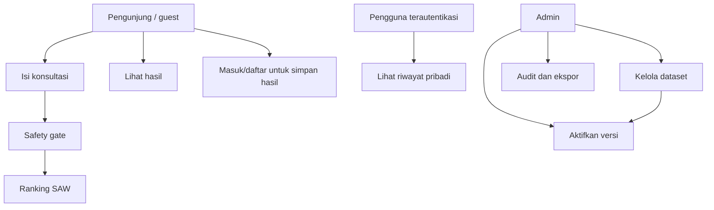
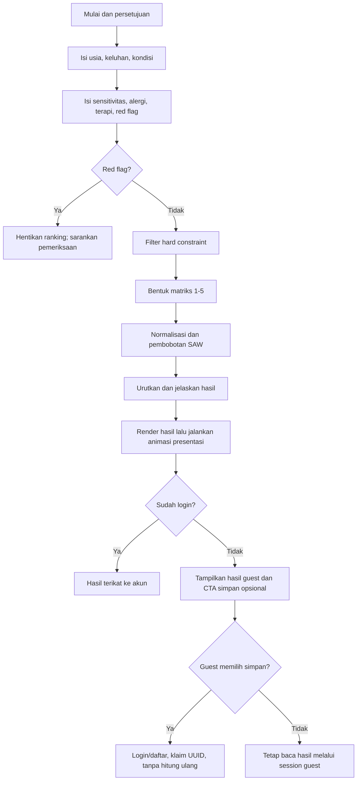
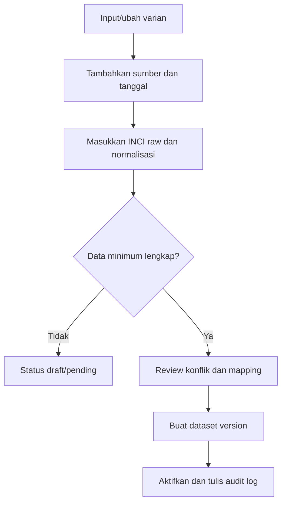
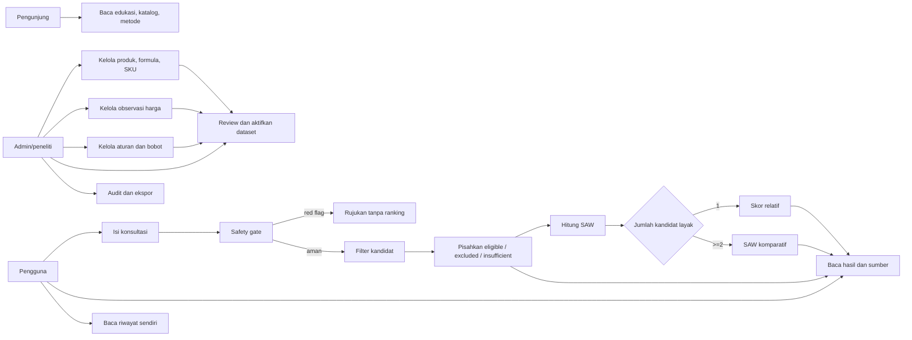
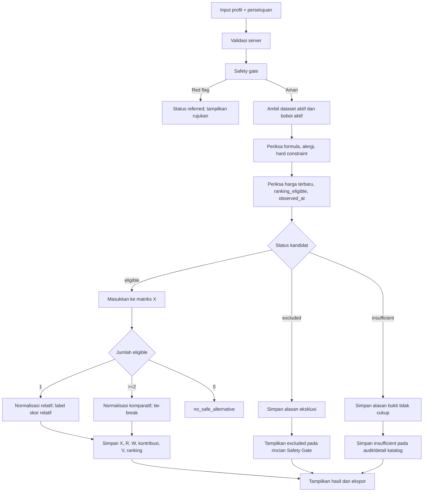

# Use Case dan Activity Diagram

## 1. Daftar aktor dan use case

| ID | Aktor | Use case |
|---|---|---|
| UC-01 | Pengunjung/pengguna | Membaca informasi dan menyetujui batasan |
| UC-02 | Pengguna | Mengisi profil usia dan kulit |
| UC-03 | Pengguna | Mengisi skrining keamanan |
| UC-04 | Sistem | Menjalankan safety gate |
| UC-05 | Sistem | Menyaring alternatif dan menghitung SAW |
| UC-06 | Pengguna | Melihat ranking, alasan, peringatan, dan sumber |
| UC-07 | Pengguna terautentikasi | Melihat riwayat rekomendasi sendiri |
| UC-08 | Admin | Mengelola merek, varian, formula, dan harga |
| UC-09 | Admin | Mengelola knowledge base dan bobot |
| UC-10 | Admin | Memverifikasi dan mengaktifkan versi dataset |
| UC-11 | Admin | Melihat audit dan mengekspor data penelitian |
| UC-12 | Sistem antarmuka | Memberikan umpan balik visual yang aksesibel tanpa mengubah hasil perhitungan |
| UC-13 | Pengguna guest | Menyelesaikan konsultasi dan melihat hasil tanpa login |
| UC-14 | Pengguna guest | Meminta penyimpanan hasil ke akun setelah hasil tersedia |
| UC-15 | Pengguna terautentikasi | Mengklaim hasil guest ke akun tanpa menghitung ulang |

## 2. Diagram use case ringkas

## 3. Activity konsultasi

## 4. Skenario UC-05 - Menghasilkan rekomendasi

**Prakondisi:** input lengkap, dataset aktif tersedia, dan konsultasi lolos red flag.

**Alur utama:**

1. Sistem mengambil versi bobot, aturan, dan produk aktif.
2. Sistem mengecualikan formula yang memiliki konflik hard constraint.
3. Sistem menghitung skor mentah C1-C6 dari rule yang memiliki bukti.
4. Sistem menormalisasi matriks.
5. Sistem mengalikan nilai normalisasi dengan bobot aktif.
6. Sistem mengurutkan skor menurun dan menerapkan tie-break.
7. Sistem menyimpan snapshot dan menampilkan tiga teratas.
8. Jika pengguna belum login, sistem tetap menampilkan hasil dan menawarkan penyimpanan ke akun secara opsional.
9. Jika autentikasi selesai, sistem mengaitkan UUID konsultasi guest ke akun tanpa menjalankan ulang safety gate atau SAW.

**Alur alternatif:** tidak ada alternatif yang lolos. Sistem tidak memaksa ranking; tampilkan bahwa data/formula yang ada belum memenuhi batas keamanan dan sarankan konsultasi profesional bila keluhan menetap.

**Postkondisi antarmuka:** hasil telah tersedia secara semantik di DOM. Anime.js kemudian menampilkan kartu ranking, skor, dan kontribusi secara bertahap. Jika reduced motion aktif atau JavaScript gagal, seluruh informasi tetap terbaca tanpa perubahan substansi.

## 5. Activity admin publikasi data

## 6. Pembaruan use case v3.3

### 6.1 Use case aktual

### 6.2 Activity evaluasi dengan transparansi non-ranking

### 6.3 Perubahan skenario UC-05

Postkondisi UC-05 sekarang juga menyimpan jumlah kandidat tiap status, mode skor, alasan eksklusi, dan referensi foto. Kandidat `excluded` ditampilkan di rincian Safety Gate sebagai informasi audit, tetapi tidak dapat dipilih sebagai hasil rekomendasi. `insufficient_evidence` disimpan untuk audit dan tidak menjadi kartu ranking; harga observasinya dapat dilihat pada detail katalog dengan label riwayat/tidak layak. Tidak ada galeri non-ranking terpisah.

## 7. Skenario UC-13/14/15 — Konsultasi guest dan penyimpanan riwayat

**Prakondisi:** aplikasi tersedia, session browser aktif, dan pengguna belum wajib memiliki akun.

**Alur utama:**

1. Pengguna membuka konsultasi dan menyetujui batasan.
2. Pengguna mengisi empat tahap wizard.
3. Sistem menjalankan safety gate dan SAW di server.
4. Sistem menyimpan konsultasi, snapshot, dan hasil dengan `user_id = NULL`, lalu memberi UUID pada session guest.
5. Halaman hasil menampilkan ranking dan CTA **Masuk/daftar dan simpan**.
6. Pengguna dapat memilih CTA tersebut atau melanjutkan tanpa akun.
7. Saat autentikasi selesai, sistem memverifikasi session guest, mengisi `user_id`, menghapus `expires_at`, dan mengarahkan kembali ke hasil yang sama.
8. Halaman riwayat akun menampilkan card ringkas berdasarkan hasil ranking pertama.

**Aturan:**

- Jika pengguna tidak memilih simpan, hasil tetap dapat dibaca dari browser yang sama sampai retensi guest berakhir.
- UUID guest dari browser/session lain tidak dapat membuka hasil.
- Login tidak boleh menjadi syarat sebelum perhitungan SAW karena berpotensi meningkatkan drop-off.
- Klaim tidak membuat `recommendation_run` baru; dataset, algoritma, skor, dan snapshot tetap sama.
