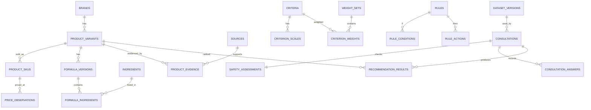

# ERD dan Kamus Data

## 1. ERD inti



## 2. Tabel master produk

| Tabel | Kolom penting | Constraint |
|---|---|---|
| `brands` | id, name, slug, official_url, is_active | name/slug unique |
| `product_variants` | id, brand_id, name, slug, target_claim, rinse_off, status | unique brand+slug |
| `product_skus` | id, variant_id, size_value, size_unit, barcode, bpom_no | unique variant+size+barcode |
| `formula_versions` | id, variant_id, version_label, inci_raw, pH_min, pH_max, verified_at, status | pH nullable; satu formula aktif per varian |
| `ingredients` | id, inci_name, display_name, function_group | inci_name unique |
| `formula_ingredients` | formula_version_id, ingredient_id, ordinal, concentration_value, concentration_unit, concentration_status | unique formula+ingredient+ordinal |
| `price_observations` | sku_id, amount, currency, seller, source_id, observed_at | amount >=0; timestamp wajib |

`concentration_status`: `declared`, `not_declared`, `range_only`, atau `unknown`. Urutan INCI tidak boleh diubah menjadi konsentrasi numerik.

## 3. Tabel sumber dan validasi

| Tabel | Fungsi |
|---|---|
| `sources` | URL, judul, penerbit, tipe, tanggal publikasi/akses, checksum/file evidence |
| `product_evidence` | Menghubungkan sumber ke klaim/komposisi/ukuran/harga varian |
| `expert_validations` | Ringkasan validator, tanggal, scope, izin kutip, status bukti |
| `audit_logs` | Aktor, tindakan, entitas, before/after JSON, timestamp |

Jenis sumber: `official_product_page`, `official_catalog`, `package_label`, `official_store`, `regulator`, `retailer_supplemental`, `scientific`, `expert_summary`.

## 4. Tabel knowledge base dan SAW

| Tabel | Kolom penting |
|---|---|
| `criteria` | code C1-C6, name, type benefit/cost, description |
| `criterion_scales` | criterion_id, score 1-5, label, operational_definition |
| `weight_sets` | name, source, validated_at, is_active, version |
| `criterion_weights` | weight_set_id, criterion_id, raw_value, normalized_value |
| `rules` | code, category, priority, severity, explanation, source_id, version |
| `rule_conditions` | rule_id, field, operator, value_json |
| `rule_actions` | rule_id, action_type, target, value_json |
| `product_scores` | dataset_version_id, variant_id, criterion_id, context_key, score, rationale |
| `dataset_versions` | version, status, activated_at, hash, notes |

## 5. Tabel konsultasi

| Tabel | Data |
|---|---|
| `consultations` | uuid, user_id nullable, age_group, dataset_version_id, algorithm_version, consent_at |
| `consultation_answers` | consultation_id, question_code, selected_value JSON |
| `safety_assessments` | red_flag, hard_constraint_codes JSON, outcome, explanation_codes JSON |
| `recommendation_runs` | consultation_id, weight_set_id, started_at, completed_at, status |
| `recommendation_results` | run_id, variant_id, rank, raw_scores JSON, normalized_scores JSON, contributions JSON, final_score, eligibility_status |

## 6. Constraint PostgreSQL yang disarankan

```sql
ALTER TABLE criterion_weights
  ADD CONSTRAINT weight_between_zero_one
  CHECK (normalized_value > 0 AND normalized_value <= 1);

ALTER TABLE criterion_scales
  ADD CONSTRAINT scale_one_to_five CHECK (score BETWEEN 1 AND 5);

ALTER TABLE formula_versions
  ADD CONSTRAINT valid_ph_range CHECK (
    (ph_min IS NULL AND ph_max IS NULL)
    OR (ph_min BETWEEN 0 AND 14 AND ph_max BETWEEN 0 AND 14 AND ph_min <= ph_max)
  );
```

Jumlah bobot =1 divalidasi di service dalam transaksi atau deferred constraint trigger. Gunakan tipe `numeric(8,6)`, bukan float, untuk bobot dan skor.

## 7. Versioning

- Formula lama tidak dihapus; ubah status menjadi `superseded`.
- Konsultasi menunjuk `dataset_version_id` sehingga hasil lama dapat direproduksi.
- `consultations.user_id` boleh `NULL` saat dibuat sebagai guest. Setelah pengguna memilih menyimpan dan autentikasi berhasil, controller claim mengisi `user_id` serta menghapus `expires_at`; snapshot dan recommendation run tidak berubah.
- Aktivasi dataset menghitung hash dari produk, formula, mapping, aturan, dan bobot.
- Perubahan hanya pada harga dapat menghasilkan minor version; perubahan formula/aturan menghasilkan major version penelitian.

## 8. Kolom audit hasil v3.3

`recommendation_runs.calculation_snapshot` menyimpan `eligible_count`, `score_mode`, daftar kandidat eligible, alasan kandidat excluded/insufficient, X, R, W, kontribusi, V, ranking, dataset version/hash, algorithm version, dan scoring version.

`recommendation_results.eligibility_status` sekurang-kurangnya memiliki nilai:

| Nilai | Arti |
|---|---|
| `eligible` | Masuk matriks dan dapat memperoleh rank/final score |
| `excluded` | Diperiksa tetapi dikeluarkan oleh safety gate atau preferensi harga |
| `insufficient_evidence` | Tidak diranking karena bukti minimum/harga tidak cukup atau stale |

Result view boleh menampilkan semua baris tersebut untuk audit, tetapi hanya `eligible` yang menjadi kartu ranking. Foto diambil dari relasi varian/SKU dan tidak mengubah status data.
