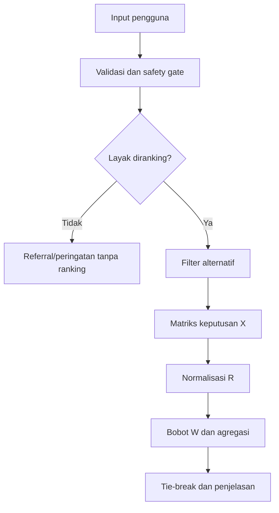
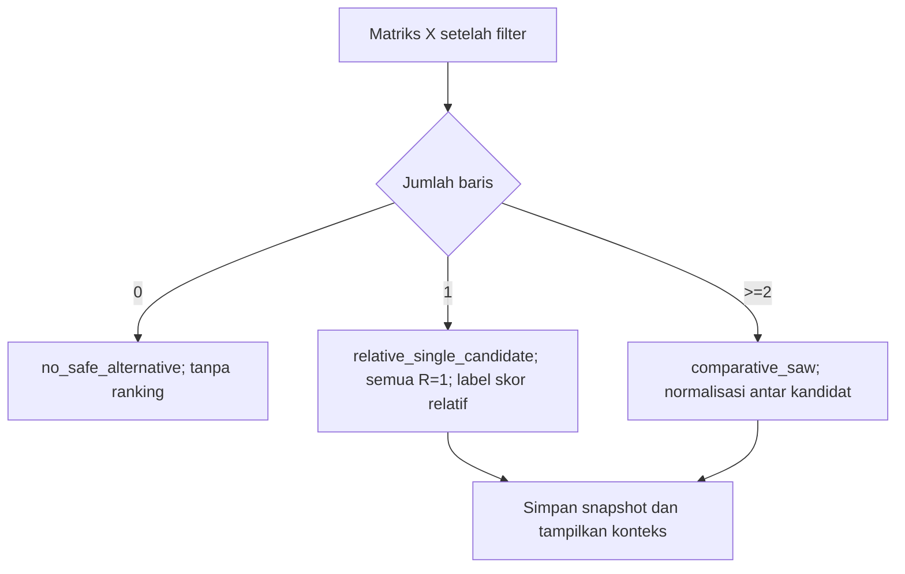

# Alur Perhitungan Simple Additive Weighting

## 1. Pipeline



## 2. Matriks keputusan

Untuk `m` alternatif dan 6 kriteria:

`X = [x_ij]`, dengan `x_ij` adalah nilai alternatif `i` pada kriteria `j`.

C1, C2, C3, C5, C6 memakai skor 1-5. C4 disarankan memakai harga per 100 ml/g sebagai cost numerik.

## 3. Normalisasi

Benefit:

`r_ij = x_ij / max_i(x_ij)`

Cost:

`r_ij = min_i(x_ij) / x_ij`

Semua nilai cost harus lebih dari 0. Bila pendekatan harga kategori 1-5 dipilih, C4 diubah menjadi benefit dan aturan kategorinya harus dibekukan sebelum penelitian.

## 4. Nilai preferensi

`V_i = sum(w_j * r_ij)` untuk j=1..6.

Bobot: `[0.1923077, 0.1923077, 0.1923077, 0.1153846, 0.1153846, 0.1923077]`.

## 5. Contoh dummy - bukan hasil produk aktual

Tiga alternatif ilustratif A, B, C yang sudah lolos safety gate:

| Alt | C1 | C2 | C3 | C4 harga/100 | C5 | C6 |
|---|---:|---:|---:|---:|---:|---:|
| A | 5 | 4 | 4 | 45.000 | 4 | 5 |
| B | 4 | 5 | 5 | 60.000 | 3 | 5 |
| C | 3 | 3 | 4 | 35.000 | 5 | 4 |

Normalisasi:

| Alt | R1 | R2 | R3 | R4 | R5 | R6 |
|---|---:|---:|---:|---:|---:|---:|
| A | 1,0000 | 0,8000 | 0,8000 | 0,7778 | 0,8000 | 1,0000 |
| B | 0,8000 | 1,0000 | 1,0000 | 0,5833 | 0,6000 | 1,0000 |
| C | 0,6000 | 0,6000 | 0,8000 | 1,0000 | 1,0000 | 0,8000 |

Nilai akhir: A=0,874359; B=0,867308; C=0,769231. Nilai dihitung dengan bobot presisi `5/26` dan `3/26`; pembulatan hanya dilakukan untuk tampilan. Contoh ini hanya menguji rumus, bukan menyatakan produk tertentu terbaik.

## 6. Tie-break

Jika selisih skor <=0,0001, urutkan berdasarkan:

1. C6 kualitas/keamanan tertinggi.
2. C1 keluhan tertinggi.
3. C2 kondisi kulit tertinggi.
4. C3 formulasi tertinggi.
5. Harga unit lebih rendah.
6. Nama varian ascending untuk hasil deterministik.

## 7. Kasus khusus

- Tidak ada alternatif lolos: tampilkan alasan, jangan mengendurkan safety gate.
- Hanya satu alternatif lolos: tampilkan sebagai opsi tersaring, bukan bukti terbaik universal.
- Nilai sama semua pada benefit: normalisasi tetap 1 untuk nilai maksimum yang sama.
- Harga nol/missing: tandai tidak dapat dihitung; jangan set nol.
- Data formula tidak lengkap: `insufficient_evidence`, bukan skor netral otomatis.

## 10. Perilaku hasil pada implementasi v3.2

### 10.1 Status sebelum matriks

Sebelum membentuk X, service memisahkan hasil pemeriksaan menjadi:

```text
eligible              -> masuk X, R, kontribusi, V, dan ranking
excluded              -> disimpan dengan alasan; tidak masuk X
insufficient_evidence -> disimpan dengan alasan; tidak masuk X
```

Contoh alasan yang wajib dapat dibaca: konflik scrub/barrier (`HC-02`), banyak iritan (`HC-03`), alergi, di bawah/di atas anggaran, `stale_price`, `missing_fresh_price`, dan `ineligible_price_evidence`.

### 10.2 Mode jumlah kandidat



Nilai satu kandidat `V=1,0000` adalah hasil normalisasi relatif karena nilai kandidat menjadi maksimum benefit sekaligus minimum cost pada matriks tunggal. UI dan dokumen tidak boleh menyebutnya sebagai nilai absolut.

### 10.3 Harga bertanggal

Admin memperbarui harga dengan membuat `price_observation` baru. Observasi lama tidak dihapus. Evaluasi menggunakan observasi terbaru yang memenuhi `is_available`, `ranking_eligible`, dan usia maksimum `PRICE_MAX_AGE_DAYS` (default 30 hari). Perubahan dataset perlu dipublikasikan melalui versi dataset agar hasil baru memiliki hash dan snapshot yang dapat direproduksi.

### 10.4 Audit dan tampilan

Hasil menyimpan jumlah kandidat layak/dikeluarkan/data tidak cukup, X, R, W, kontribusi, V, ranking, alasan, dataset, algoritma, dan scoring version. Halaman hasil menampilkan kandidat `excluded` beserta foto jika tersedia di dalam rincian Safety Gate, dalam keadaan redup dan tanpa tautan rekomendasi. Tidak ada galeri non-ranking terpisah. Rincian ini menjadi bagian UAT-11 sampai UAT-19 pada dokumen UAT.

## 8. Audit output

Simpan `input_snapshot`, `eligible_variants`, alasan eksklusi, X, R, W, kontribusi `w*r`, nilai V, ranking, tie-break, dataset version, algorithm version, dan timestamp.

## 9. Unit test wajib

- Benefit normalization.
- Cost normalization.
- Bobot berjumlah 1.
- Hard constraint dieksekusi sebelum matriks.
- Tie-break deterministik.
- Hasil contoh dummy sama dengan kalkulasi referensi dalam toleransi 1e-6.
